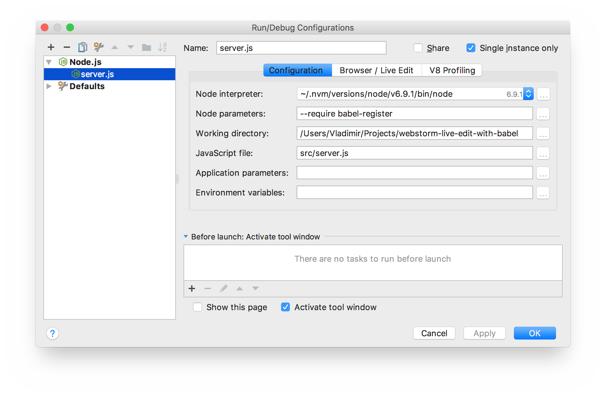
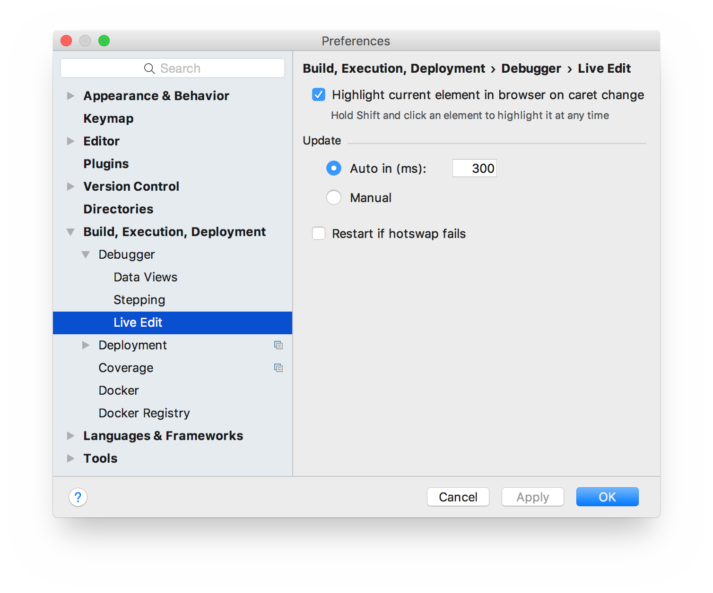
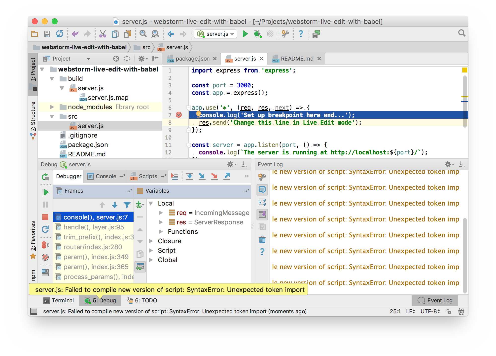

# WebStorm Live Edit Playground

Re: [Live Edit Updates in WebStorm 9 — What’s New?](https://blog.jetbrains.com/webstorm/2014/08/live-edit-updates-in-webstorm-9/)

Right now if you will try to debug the code compiled by babel v6.16 on the fly in WebStorm 2016.3.1 you will get this error after first hot change in Live Edit mode:

> Failed to compile new version of script: SyntaxError: Unexpected token import

## Steps to reproduce:

1. Install [Git](https://git-scm.com/) or [GitHub Desktop](https://desktop.github.com/)
2. Install [Node.js](https://nodejs.org/en/) 6.9.1
3. Install [WebStorm](https://www.jetbrains.com/webstorm/) 2016.3.1
4. Download the project and install dependencies

    ```sh
    $ git clone https://github.com/frenzzy/webstorm-live-edit-with-babel.git
    $ cd webstorm-live-edit-with-babel
    $ npm install
    ```

5. Open the project via WebStorm and lunch toolbar: `Run` -> `Edit Configurations...`, then click plus `Add New Configuration (Cmd+N)` and pick `Node.js`. Set up following:

    - Node interpreter: pick node 6.9.1
    - Node parameters: `--require babel-register`
    - Working directory: select current directory
    - JavaScript file: `src/server.js`

    

6. Configure Live Edit via toolbar: `WebStorm` -> `Preferences (Cmd+,)`, then `Build, Execution, Deployment` -> `Debugger` -> `Live Edit` and pick `Auto in (ms)`

    

7. Set up breakpoint on [line 7 in src/server.js](./src/server.js#L7) and start debugging via toolbar: `Run` -> `Debug... (Ctrl+Alt+D)`, then open [http://localhost:3000/](http://localhost:3000/) in your browser to call breakpoint.


8. Edit something on [line 8 in src/server.js](./src/server.js#L8) and save the file, you will see the error:

    > server.js: Failed to compile new version of script: SyntaxError: Unexpected token import

    
